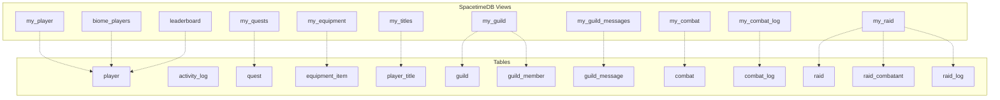

# Reallife MMO — SpacetimeDB Entity Model

> Phase 4 data model for the full SpacetimeDB migration.
> Existing tables (combat, combat_log, spell, player) are extended; new tables added for all game systems.

---

## ER Diagram

```mermaid
erDiagram
    %% ════════════════════════════════════════════════════════════════
    %% PLAYER CORE
    %% ════════════════════════════════════════════════════════════════

    player {
        Identity identity PK "SpacetimeDB identity"
        string   name
        u32      level
        u32      xp
        u32      xp_to_next
        u32      hp
        u32      max_hp
        u32      gold
        u32      streak_days
        u32      total_activities
        u32      quests_completed
        string   current_biome
        string   current_location "nullable"
        string   active_title "nullable"
        enum     player_class "Warrior|Mage|Rogue|..."
        bool     online
        Timestamp joined_at
        string   last_activity_date
        u32      str
        u32      agi
        u32      int_stat
        u32      con
        u32      wis
        u32      cha
        u32      mp
        u32      pvp_wins
        u32      pvp_losses
    }

    activity_log {
        u64      id PK "autoInc"
        Identity player_id FK
        enum     activity_type "StrengthTraining|Cardio|..."
        f32      raw_value
        f32      duration_min
        u8       intensity
        Timestamp timestamp
        string   note "nullable"
        f32      delta_str
        f32      delta_agi
        f32      delta_int
        f32      delta_con
        f32      delta_wis
        f32      delta_cha
        f32      delta_mp
    }

    quest {
        u64      id PK "autoInc"
        Identity player_id FK
        string   title
        string   description
        enum     quest_type "daily|weekly|custom"
        enum     activity_type "nullable"
        u32      target_min
        u32      progress_min
        u32      xp_reward
        bool     completed
        bool     claimed
        Timestamp expires_at "0 = no expiry"
        bool     manual_complete
    }

    equipment_item {
        string   id PK "deterministic hash"
        Identity player_id FK
        string   name
        enum     slot "weapon|armor|head|accessory"
        enum     rarity "common|uncommon|rare|epic|legendary"
        bool     equipped
        u32      level_req
        string   source
        i32      bonus_str
        i32      bonus_agi
        i32      bonus_int
        i32      bonus_con
        i32      bonus_wis
        i32      bonus_cha
        i32      bonus_mp
    }

    player_title {
        Identity player_id FK "composite PK"
        string   title_id FK "composite PK"
        Timestamp unlocked_at
    }

    %% ════════════════════════════════════════════════════════════════
    %% SOCIAL / GUILDS
    %% ════════════════════════════════════════════════════════════════

    guild {
        u64      id PK "autoInc"
        string   name "unique"
        string   tag "max 4 chars"
        string   description
        Timestamp created_at
        u32      max_members "default 20"
        u32      raid_wins
    }

    guild_member {
        u64      guild_id FK "composite PK"
        Identity player_id FK "composite PK"
        enum     role "leader|officer|member"
        Timestamp joined_at
    }

    guild_message {
        u64      id PK "autoInc"
        u64      guild_id FK
        Identity author_id FK
        string   author_name "denormalized for perf"
        string   text
        Timestamp timestamp
    }

    %% ════════════════════════════════════════════════════════════════
    %% PVP COMBAT (extends existing)
    %% ════════════════════════════════════════════════════════════════

    combat {
        u64      id PK "autoInc"
        Identity player1 FK
        Identity player2 FK "nullable until matched"
        u32      player1_hp
        u32      player2_hp
        u32      player1_mana
        u32      player2_mana
        Identity current_turn
        enum     status "WaitingForPlayers|InProgress|Finished"
        Identity winner_id "nullable"
    }

    combat_log {
        u64      id PK "autoInc"
        u64      combat_id FK
        Identity caster_id FK
        string   spell_name
        u32      damage
        bool     is_heal
        Timestamp timestamp
    }

    spell {
        u64      id PK "autoInc"
        string   name
        enum     element "Fire|Ice|Lightning|Physical|Arcane|Heal"
        u32      damage
        u32      mana_cost
        bool     is_heal
    }

    %% ════════════════════════════════════════════════════════════════
    %% RAID SYSTEM
    %% ════════════════════════════════════════════════════════════════

    raid {
        u64      id PK "autoInc"
        u64      guild_id FK
        string   biome_id
        string   boss_id
        enum     phase "lobby|fighting|victory|defeat"
        u32      boss_hp
        u32      boss_max_hp
        u32      boss_mana
        u32      current_turn_index
        Timestamp started_at
    }

    raid_combatant {
        u64      raid_id FK "composite PK"
        Identity player_id FK "composite PK"
        u32      hp
        u32      max_hp
        u32      mana
        u32      max_mana
        bool     ko
    }

    raid_log {
        u64      id PK "autoInc"
        u64      raid_id FK
        string   caster
        string   target
        string   spell_name
        string   element
        u32      damage
        bool     is_heal
    }

    %% ════════════════════════════════════════════════════════════════
    %% RELATIONSHIPS
    %% ════════════════════════════════════════════════════════════════

    player ||--o{ activity_log : "logs activities"
    player ||--o{ quest : "has quests"
    player ||--o{ equipment_item : "owns items"
    player ||--o{ player_title : "unlocks titles"

    player ||--o{ guild_member : "joins guilds"
    guild ||--o{ guild_member : "has members"
    guild ||--o{ guild_message : "has chat"
    player ||--o{ guild_message : "writes messages"

    player ||--o{ combat : "fights as player1"
    player ||--o{ combat : "fights as player2"
    combat ||--o{ combat_log : "produces events"

    guild ||--o{ raid : "starts raids"
    raid ||--o{ raid_combatant : "has fighters"
    player ||--o{ raid_combatant : "participates"
    raid ||--o{ raid_log : "produces events"
```

---

## Client Subscription Views

Views are SpacetimeDB server-side projections that filter data per-caller. The client subscribes to views instead of raw tables — this ensures players only receive their own data and nearby players.

---

## View Definitions

| View                  | Returns                                              | Filter                                                          | Use Case                                 |
| --------------------- | ---------------------------------------------------- | --------------------------------------------------------------- | ---------------------------------------- |
| **my_player**         | `Option<player>`                                     | `identity = caller`                                             | Character sheet, dashboard, stat display |
| **my_equipment**      | `Vec<equipment_item>`                                | `player_id = caller`                                            | Inventory, chest, equip/unequip UI       |
| **my_quests**         | `Vec<quest>`                                         | `player_id = caller`                                            | Quest log, daily quest list              |
| **my_titles**         | `Vec<player_title>`                                  | `player_id = caller`                                            | Title selector, achievement display      |
| **my_guild**          | `Option<guild> + Vec<guild_member>`                  | `guild_member.player_id = caller` → join to guild               | Guild page, member list, raid panel      |
| **my_guild_messages** | `Vec<guild_message>` (last 50)                       | `guild_id = my_guild_id`                                        | Guild chat                               |
| **my_combat**         | `Option<combat>`                                     | `(player1 = caller OR player2 = caller) AND status != Finished` | Active PvP battle                        |
| **my_combat_log**     | `Vec<combat_log>`                                    | `combat_id = my_active_combat_id`                               | PvP combat feed                          |
| **my_raid**           | `Option<raid> + Vec<raid_combatant> + Vec<raid_log>` | `guild_id = my_guild_id AND phase != victory/defeat`            | Active raid UI                           |
| **biome_players**     | `Vec<{name, class, level, title, biome}>`            | `current_biome = caller's biome AND online = true`              | City scene — other players in same biome |
| **leaderboard**       | `Vec<{name, class, level, pvp_wins}>` (top 50)       | `ORDER BY level DESC LIMIT 50`                                  | Leaderboard page                         |

---

## Enum Types

| Enum             | Values                                                                                                       |
| ---------------- | ------------------------------------------------------------------------------------------------------------ |
| **ActivityType** | `StrengthTraining, Cardio, Hiit, MindLearning, Nutrition, Hydration, Sleep, Mindfulness, Creativity, Social` |
| **PlayerClass**  | `Warrior, Mage, Rogue, Paladin, Druid, Ranger, Bard, Scholar, Unclassed`                                     |
| **QuestType**    | `daily, weekly, custom`                                                                                      |
| **EquipSlot**    | `weapon, armor, head, accessory`                                                                             |
| **ItemRarity**   | `common, uncommon, rare, epic, legendary`                                                                    |
| **GuildRole**    | `leader, officer, member`                                                                                    |
| **CombatStatus** | `WaitingForPlayers, InProgress, Finished`                                                                    |
| **SpellElement** | `Fire, Ice, Lightning, Physical, Arcane, Heal`                                                               |
| **RaidPhase**    | `lobby, fighting, victory, defeat`                                                                           |

---

## Reducers (Write Operations)

| Reducer                 | Tables Modified                                           | Description                                                                                                                          |
| ----------------------- | --------------------------------------------------------- | ------------------------------------------------------------------------------------------------------------------------------------ |
| **create_player**       | player                                                    | Set name on first connect (identity auto-created via clientConnected)                                                                |
| **log_activity**        | activity_log, player, quest, player_title, equipment_item | Core game loop: log activity → calc deltas → update stats/xp → check quest progress → check title/item unlocks → check biome unlocks |
| **claim_quest**         | quest, player                                             | Claim XP reward from completed quest                                                                                                 |
| **create_custom_quest** | quest                                                     | Create a custom quest with manual completion                                                                                         |
| **equip_item**          | equipment_item                                            | Set `equipped = true`, unequip previous item in same slot                                                                            |
| **unequip_item**        | equipment_item                                            | Set `equipped = false`                                                                                                               |
| **buy_item**            | equipment_item, player                                    | Deduct gold, add item to inventory                                                                                                   |
| **sell_item**           | equipment_item, player                                    | Remove item, add gold                                                                                                                |
| **rest_at_city**        | player                                                    | Restore HP to max, deduct gold                                                                                                       |
| **travel_to_biome**     | player                                                    | Change current_biome, clear current_location                                                                                         |
| **enter_location**      | player                                                    | Set current_location within biome                                                                                                    |
| **select_title**        | player                                                    | Set active_title                                                                                                                     |
| **create_guild**        | guild, guild_member                                       | Create guild, add creator as leader                                                                                                  |
| **join_guild**          | guild_member, guild_message                               | Add member, post system message                                                                                                      |
| **leave_guild**         | guild_member, guild_message                               | Remove member, promote new leader if needed                                                                                          |
| **send_guild_message**  | guild_message                                             | Post chat message (cap at 50 per guild)                                                                                              |
| **promote_member**      | guild_member                                              | Change role to officer                                                                                                               |
| **kick_member**         | guild_member, guild_message                               | Remove member                                                                                                                        |
| **join_combat**         | combat, player                                            | Create or join PvP match                                                                                                             |
| **cast_spell**          | combat, combat_log                                        | Execute spell in PvP combat                                                                                                          |
| **leave_combat**        | combat                                                    | Forfeit match                                                                                                                        |
| **start_raid**          | raid, raid_combatant, guild_message                       | Start boss fight for guild                                                                                                           |
| **raid_cast_spell**     | raid, raid_combatant, raid_log                            | Execute turn in raid combat                                                                                                          |
| **abandon_raid**        | raid, raid_combatant, raid_log                            | Reset active raid                                                                                                                    |
| **idle_tick**           | player, quest                                             | Scheduled hourly: streak check, quest refresh, raid expiry                                                                           |

---

## Index Strategy

| Table          | Index                        | Purpose                            |
| -------------- | ---------------------------- | ---------------------------------- |
| player         | `identity` (PK, unique)      | All lookups                        |
| player         | `current_biome` (btree)      | biome_players view                 |
| player         | `level` (btree)              | leaderboard sorting                |
| activity_log   | `player_id` (btree)          | my activities lookup               |
| activity_log   | `timestamp` (btree)          | 30-day window for class derivation |
| quest          | `player_id` (btree)          | my quests                          |
| equipment_item | `player_id` (btree)          | my inventory                       |
| player_title   | `player_id` (btree)          | my titles                          |
| guild_member   | `player_id` (btree)          | find player's guild                |
| guild_member   | `guild_id` (btree)           | list guild members                 |
| guild_message  | `guild_id` (btree)           | guild chat history                 |
| combat         | `player1`, `player2` (btree) | find active combat                 |
| combat_log     | `combat_id` (btree)          | combat event stream                |
| raid           | `guild_id` (btree)           | find active raid                   |
| raid_combatant | `raid_id` (btree)            | raid participants                  |
| raid_log       | `raid_id` (btree)            | raid event stream                  |

---

## Migration Notes

### What moves server-side

- All state mutations currently in `gameStore.ts` and `guildStore.ts` become reducers
- `statEngine.ts` and `classEngine.ts` logic is duplicated server-side (Rust or TS) — server is authoritative, client keeps copies for delta previews
- `questGenerator.ts` moves to `idle_tick` scheduled reducer
- `rewards.ts` milestone checks move into `log_activity` reducer

### What stays client-side

- `statEngine.ts` / `classEngine.ts` — for preview calculations before confirming a log
- Zustand stores become thin caches that mirror SpacetimeDB subscription state
- All UI state (selected tabs, modals, animations)
- NPC players for leaderboard (until real player base exists)
